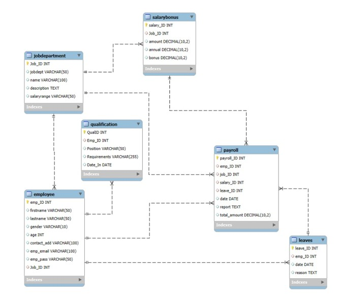

# Employee Management & Payroll Analysis System (MySQL)

## 📌 Project Overview

This project is a MySQL-based Employee Management and Payroll Analysis System designed to manage employees, departments, salaries, qualifications, leaves, and payroll operations.

The system demonstrates:
- Relational database design
- Primary & Foreign key relationships
- Cascading constraints
- Payroll and compensation analysis
- Real-world HR data insights using SQL queries

---

## 🗂 Database Structure

The project consists of 6 relational tables:

### 1️⃣ JobDepartment
Stores department and job role information.
- Job_ID (Primary Key)
- jobdept (Department Name)
- name (Job Role Name)
- description
- salaryrange

---

### 2️⃣ SalaryBonus
Stores salary and bonus details linked to job roles.
- salary_ID (Primary Key)
- Job_ID (Foreign Key → JobDepartment)
- amount
- annual
- bonus

✔ ON DELETE CASCADE  
✔ ON UPDATE CASCADE 

---

### 3️⃣ Employee
Stores employee personal and job information.
- emp_ID (Primary Key)
- firstname
- lastname
- gender
- age
- contact_add
- emp_email (Unique)
- emp_pass
- Job_ID (Foreign Key → JobDepartment)

✔ ON DELETE SET NULL  
✔ ON UPDATE CASCADE  

---

### 4️⃣ Qualification
Stores employee qualification and position requirements.
- QualID (Primary Key)
- Emp_ID (Foreign Key → Employee)
- Position
- Requirements
- Date_In

✔ ON DELETE CASCADE  

---

### 5️⃣ Leaves
Tracks employee leave records.
- leave_ID (Primary Key)
- emp_ID (Foreign Key → Employee)
- date
- reason

✔ ON DELETE CASCADE  

---

### 6️⃣ Payroll
Manages payroll processing and compensation tracking.
- payroll_ID (Primary Key)
- emp_ID (Foreign Key → Employee)
- job_ID (Foreign Key → JobDepartment)
- salary_ID (Foreign Key → SalaryBonus)
- leave_ID (Foreign Key → Leaves)
- date
- report
- total_amount

✔ Multiple cascading constraints implemented  

---

## Entity Relationship Diagram

## 📊 Business & HR Analysis Queries

This project includes structured analytical queries divided into 5 major areas:

### 🔹 1. Employee Insights
- Count of unique employees
- Department-wise employee distribution
- Average salary per department
- Top 5 highest-paid employees
- Total company salary expenditure

---

### 🔹 2. Job Role & Department Analysis
- Number of job roles per department
- Highest-paying job role
- Department-wise salary allocation
- Salary distribution analysis

---

### 🔹 3. Qualification & Skills Analysis
- Employees with qualifications
- Positions requiring most qualifications
- Employees with highest qualifications

---

### 🔹 4. Leave & Absence Patterns
- Year with most employee leaves
- Average leave per department
- Employees with highest leave count
- Leave-to-payroll correlation analysis

---

### 🔹 5. Payroll & Compensation Analysis
- Total monthly payroll
- Average bonus per department
- Department with highest bonus payout
- Average net payroll after leave deductions

---

## 🚀 Key Concepts Demonstrated

- Relational Database Design
- Primary & Foreign Key Constraints
- Cascading Delete & Update Rules
- Aggregate Functions (COUNT, SUM, AVG)
- GROUP BY & ORDER BY
- Subqueries
- JOIN operations (INNER JOIN)
- Business Insight Generation using SQL

---

## 💻 Technologies Used

- MySQL
- SQL

---

## ▶️ How to Run

1. Open MySQL Workbench (or any MySQL client)
2. Execute the SQL file
3. Run analysis queries included at the bottom of the script

---

## 👨‍💻 Author

**Vishnu Yadav**  
🔗 LinkedIn: https://www.linkedin.com/in/boyanavishnuvardan  
🔗 GitHub: https://github.com/Boyana-Vishnuvardan02
